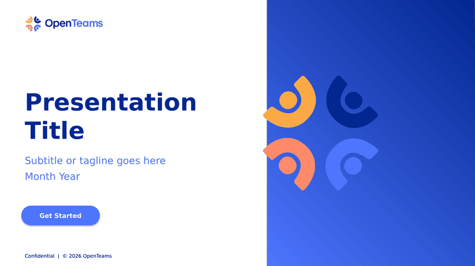
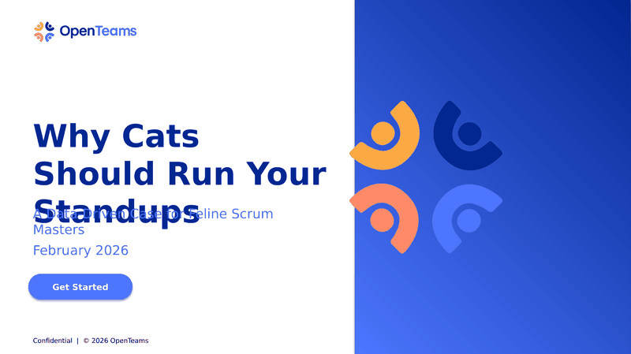

<div align="center">
<pre>
██████╗ ██████╗ ████████╗
██╔══██╗██╔══██╗╚══██╔══╝
██████╔╝██████╔╝   ██║   
██╔═══╝ ██╔═══╝    ██║   
██║     ██║        ██║   
╚═╝     ╚═╝        ╚═╝   

Brand & Presentation Toolkit
─────────────────────────
</pre>
</div>

<p align="center">
  <a href="https://discord.gg/YmsT7FFnW8"></a>
  <a href="https://github.com/athurdekoos/ppt"></a>
  <a href="https://openteams.com"></a>
  <a href="https://www.linkedin.com/in/amelia-thurdekoos-26450b86/"></a>
</p>

<p align="center">
  <strong>Data → Slides → Skills</strong> — the OpenTeams automation pipeline
</p>

<p align="center">
  
</p>

---

## How It All Connects

This repo is part of the **OpenTeams automation ecosystem** — a pipeline that turns raw GitHub data into polished, brand-compliant deliverables:

```
                              ┌──────────────────────┐     ┌─────────────────────┐
  (external data source)      │   Output Layer       │     │   Distribution      │
                              │                      │     │                     │
  GitHub GraphQL ────────────▶│  ppt/                │────▶│  skill-packager/    │
  PR/issue reports            │  openteams-pptx/     │     │  npx installer      │
                              │  personal-showcase/  │     │                     │
                              │  Brand assets        │     │  pi + Claude Code   │
                              │  Brand guidelines    │     │  agent skills       │
                              └──────────────────────┘     └─────────────────────┘
```

| Component | Role | Location |
|-----------|------|----------|
| **ppt** ← _you are here_ | Brand assets + AI-powered PPTX generator + showcase | [athurdekoos/ppt](https://github.com/athurdekoos/ppt) |
| **skill-packager** | Scaffolds and packages agent skills for distribution | Bundled in `skill-packager/` |
| **personal-showcase** | HTML portfolio page generator (3 themes) | Bundled in `personal-showcase/` |

> **Upstream data:** PR/issue reports can be fed from any GitHub GraphQL data pipeline.

---

## 🚀 Quick Start

**Prerequisites:** Python 3.8+, Node.js 16+ (only needed for the `npx` installer)

```bash
# Clone and install Python dependencies
git clone https://github.com/athurdekoos/ppt.git && cd ppt
pip install -r requirements.txt

# Generate a demo deck
python3 openteams-pptx/scripts/generate_deck.py --demo \
  --brand openteams-pptx/references/brand.json --out demo.pptx

# Or install as an agent skill (see Install section below)
npx https://github.com/athurdekoos/ppt --pi
```

> **Note:** `build_template.py` at the repo root is a **legacy** script — use the `openteams-pptx/` skill instead.

---

## 📊 PPTX Generator

> `openteams-pptx/` — A pi agent skill that generates on-brand PowerPoint presentations from natural language.

Ask Claude to create a deck and it handles content structure, slide layout, brand compliance, and `.pptx` output.

**Quick example:**
> "Create a 10-slide pitch deck for IBM about our open source platform"

→ Produces a branded `.pptx` with cover, agenda, content slides, metrics, case study, and closing.

**11 slide types:** cover · section divider · agenda · content · two-column · quote · metrics · team · case study · closing · blank

<details>
<summary>🐱 <strong>Example: "Why Cats Should Run Your Standups"</strong> — click to watch</summary>
<br>
<p align="center">
  
</p>

> **Prompt:** *"Make me a funny presentation about why cats would be better scrum masters than humans. Include metrics, a case study, and a roadmap."*
>
> The generator picked the right slide types automatically — cover, agenda, section divider,
> two-column comparison, bullet content, metrics dashboard, quote, case study, and closing —
> then rendered everything on-brand in seconds.

</details>

See [`openteams-pptx/README.md`](openteams-pptx/README.md) for full usage, slide types, and CLI docs.

### Install

The `bin/install.mjs` script handles installation via npx — it checks Python 3, installs `python-pptx` if needed, and copies skill files to the right location.

```bash
# As a pi skill
npx https://github.com/athurdekoos/ppt --pi

# As a Claude Code skill
npx https://github.com/athurdekoos/ppt --claude

# Run with no flags to see help
npx https://github.com/athurdekoos/ppt

# Manual CLI (no npx needed)
pip install -r requirements.txt
python3 openteams-pptx/scripts/generate_deck.py --demo \
  --brand openteams-pptx/references/brand.json --out demo.pptx
```

---

## 🎨 Brand Assets

> `Assets/` — Official OpenTeams logo files in every format and variant.

| Directory | Contents |
|-----------|----------|
| `OT_Colored_Logos/` | Full-color logos (horizontal, vertical, favicon) — PNG, JPG, SVG |
| `OT_White_Logos/` | White logos for dark backgrounds — AI, SVG, PNG |
| `OT_Black_Logos/` | Black logos for light backgrounds — AI, SVG, PNG |
| `OT_ai_Logos/` | Adobe Illustrator source files |
| `Email signature OT logo/` | Sized for email signatures (with/without tagline) |
| `Horizontal-PDF-logo/` | PDF format horizontal logo |

### Brand Colors

| Color | Hex | Role |
|-------|-----|------|
| 🔵 Night Navy | `#022791` | Primary |
| 🔷 Day Blue | `#4D75FE` | Primary bright |
| 🟠 Salmon | `#FF8A69` | Warm accent |
| 🟡 Yellow | `#FAA944` | Warm accent |
| 🟢 Accent Green | `#3AD58E` | Secondary accent |

Full guidelines: [`OpenTeams_Brand_Guidelines_2025.pdf`](OpenTeams_Brand_Guidelines_2025.pdf) (36 pages)

---

## 🌐 Personal Showcase

> `personal-showcase/` — Generate a self-contained HTML portfolio page with OpenTeams branding.

Three themes: **dark** (Night Navy), **light** (clean white), **glass** (frosted blur). No server needed — just open the `.html` file in a browser.

```bash
python3 personal-showcase/scripts/generate_showcase.py \
  --profile profile.json --out showcase.html --theme dark
```

See [`personal-showcase/README.md`](personal-showcase/README.md) for full docs and profile JSON format.

---

## 📦 Skill Packager

> `skill-packager/` — Scaffold new agent skills and package existing ones for distribution.

```bash
# Scaffold a new skill
python3 skill-packager/scripts/scaffold.py --name my-skill --description "Does amazing things" --out ./my-skill

# Package an existing skill with pi + Claude Code installers
python3 skill-packager/scripts/package.py --skill-dir ./my-skill
```

See [`skill-packager/README.md`](skill-packager/README.md) for full docs.

---

## 📋 Config Files

| File | Purpose |
|------|---------|
| [`assets_index.json`](assets_index.json) | Machine-readable index of all logo asset paths |
| [`site_style.json`](site_style.json) | Website style tokens scraped from openteams.com |
| [`openteams-pptx/references/brand.json`](openteams-pptx/references/brand.json) | Brand tokens for slide generation (colors, fonts, spacing, logos) |

---

## Repository Structure

```
ppt/
├── README.md                              # This file
├── CLAUDE.md                              # AI assistant guidance
├── package.json                           # npx installer entry point
├── OpenTeams_Brand_Guidelines_2025.pdf    # Official brand guidelines
├── assets_index.json                      # Logo asset index
├── site_style.json                        # Website style tokens
│
├── Assets/                                # Logo files (all formats/variants)
│   ├── repo-logo.svg                      # ← This repo's logo
│   ├── OT_Colored_Logos/
│   ├── OT_White_Logos/
│   ├── OT_Black_Logos/
│   ├── OT_ai_Logos/
│   ├── Email signature OT logo/
│   └── Horizontal-PDF-logo/
│
├── openteams-pptx/                        # PPTX generator skill
│   ├── README.md
│   ├── SKILL.md
│   ├── docs/ARCHITECTURE.md
│   ├── references/                        # Brand tokens + slide schemas
│   ├── scripts/                           # Python source (6 modules, ~1700 LOC)
│   └── tests/
│
├── personal-showcase/                     # HTML portfolio generator (3 themes)
│   ├── README.md
│   ├── SKILL.md
│   ├── scripts/generate_showcase.py
│   └── assets/
│
├── skill-packager/                        # Skill scaffolding + packaging tool
│   ├── README.md
│   └── scripts/
│
├── review/                                # Brand compliance audit outputs
│   └── COMPLIANCE_REPORT.md
│
└── docs/plans/                            # Historical implementation plans (completed)
```

---

## Generated Outputs

The following files are **generated artifacts** (not source code):

| Output | Generator | Notes |
|--------|-----------|-------|
| `*.pptx` files | `openteams-pptx/scripts/generate_deck.py` | Brand-compliant PowerPoint decks |
| `showcase-*.html` files | `personal-showcase/scripts/generate_showcase.py` | Self-contained portfolio pages |
| `review/COMPLIANCE_REPORT.md` | Brand audit process | Slide-by-slide compliance report |

---

## Uploading to Google Slides

Generated `.pptx` files work directly in Google Slides:

1. Go to [Google Drive](https://drive.google.com) → **New** → **File upload**
2. Double-click the uploaded file → **Open with Google Slides**
3. **File** → **Save as Google Slides** for native collaboration

> **Tip:** If fonts fall back to Arial, select all text (**Ctrl+A**) and apply **Inter Tight** from the font menu — Google Slides includes it.

---

<p align="center">
  <sub>Built by <a href="https://openteams.com">OpenTeams</a></sub>
</p>
